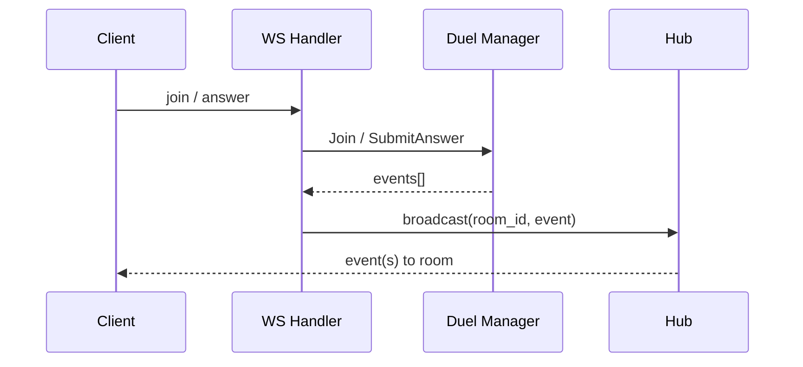

# WebSocket Flow (LangDuel MVP)

## Цель
Показать путь сообщения от клиента до игровой логики и обратно, а также формат основных JSON событий.

## Входящие сообщения (клиент -> сервер)

### join
```json
{"type":"join","room_id":"room1","user_id":"u1"}
```

### answer
```json
{"type":"answer","room_id":"room1","user_id":"u1","answer":"kot","speed":1200}
```

## Исходящие события (сервер -> клиент)

### room_state
```json
{"type":"room_state","room_id":"room1","round":1,"round_token":1,"prompt":"cat","players":["u1","u2"],"hp":{"u1":100,"u2":100}}
```

### round_start
```json
{"type":"round_start","room_id":"room1","round":1,"round_token":1,"prompt":"cat","hp":{"u1":100,"u2":100}}
```

### update
```json
{"type":"update","room_id":"room1","attacker_id":"u1","defender_id":"u2","damage":15,"correct":true,"hp":{"u1":100,"u2":85}}
```

### round_end (timeout)
```json
{"type":"round_end","room_id":"room1","round":1,"round_token":1,"prompt":"cat","reason":"timeout","hp":{"u1":100,"u2":100}}
```

### game_over
```json
{"type":"game_over","room_id":"room1","winner_id":"u1","hp":{"u1":100,"u2":0}}
```

### error
```json
{"type":"error","room_id":"room1","error":"join room first"}
```

## Последовательность обработки (схема)



## Таймер раунда
1. При `round_start` запускается таймер на 10 секунд.
2. Если нет ответа, генерируется `round_end` (reason: timeout).
3. Затем автоматически стартует новый `round_start`.

## Важные детали
- Все сообщения внутри одной комнаты изолированы.
- `round_token` позволяет отличать “старые” таймеры от актуального раунда.
