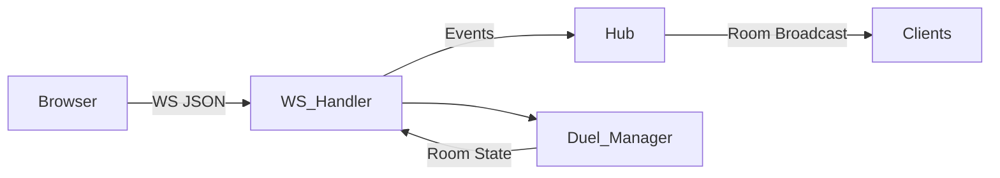

# LangDuel Architecture

## Цель документа
Кратко и наглядно описать архитектуру backend MVP LangDuel: какие есть модули, как между ними идут данные, где править игровую логику и протокол.

## Высокоуровневая схема

## Модули и ответственность

### cmd/server
Точка входа приложения.
- `cmd/server/main.go` запускает HTTP сервер, роутер, WebSocket и подключает БД.

### internal/server
HTTP слой.
- `internal/server/http.go` создает `ServeMux`.
- `internal/server/routes.go` регистрирует HTTP и WS роуты.
- `internal/server/auth.go` реализует `/auth/*`, `/me`, `/me/stats`, `/me/duels`.

### internal/ws
WebSocket транспорт.

Задачи:
- принять соединение;
- читать входящие JSON сообщения;
- вызывать `duel.Manager`;
- рассылать события только игрокам своей комнаты;
- управлять таймерами раундов.

Файлы:
- `internal/ws/handler.go` парсинг, маршрутизация, таймеры.
- `internal/ws/hub.go` изоляция комнат и рассылка.
- `internal/ws/client.go` структура клиента (conn + метаданные).

### internal/duel
Игровая логика. Этот пакет не зависит от `ws`.

Файлы:
- `internal/duel/manager.go` комнаты, игроки, обработка `join` и `answer`.
- `internal/duel/room.go` состояние комнаты, раунды, выбор фраз.
- `internal/duel/engine.go` применение урона.
- `internal/duel/damage.go` расчет урона.
- `internal/duel/message.go` структура входящих сообщений.
- `internal/duel/player.go` структура игрока.

### internal/storage
PostgreSQL доступ.
- `internal/storage/db.go` подключение к БД.
- `internal/storage/duel_repo.go` CRUD для дуэлей, участников, ответов, статистики.
- `internal/storage/local_test_phrases.go` тестовые наборы фраз.

## Поток данных (Join)

1. Клиент отправляет:
   `{"type":"join","room_id":"room1","user_id":"u1","lang":"en","topic":"default"}`
2. `ws/handler.go` вызывает `duel.Manager.Join`.
3. `duel.Manager` возвращает события:
   - `player_joined`
   - `room_state`
   - `round_start` (если в комнате 2 игрока)
4. `ws` пересылает события в `hub`, `hub` рассылает только игрокам этой комнаты.

## Поток данных (Answer)

1. Клиент отправляет:
   `{"type":"answer","room_id":"room1","user_id":"u1","answer":"кот","speed":1200}`
2. `duel.Manager.SubmitAnswer`:
   - нормализует ответ (lowercase + trim)
   - считает урон
   - обновляет HP
   - возвращает `update` и, при необходимости, `game_over`
3. `ws` рассылает события по комнате.

## События (сервер -> клиент)

Базовые:
- `room_state` - состояние комнаты
- `round_start` - старт раунда
- `update` - результат ответа и урон
- `game_over` - победитель
- `error` - ошибка

Дополнительные:
- `player_joined`
- `player_left`
- `round_end` (таймаут)

## Изоляция комнат
`Hub` хранит клиентов по `room_id` и рассылает сообщения только в соответствующую комнату.

## Таймер раунда
- Запускается на каждое `round_start`.
- Если ответа нет за `roundTimeout`, сервер шлет `round_end` и начинает следующий раунд.
- Таймер не наносит урон, он не дает игре “зависнуть”.

## Контракт событий (фиксируем для Svelte)

Клиент -> сервер:
- `join`: `room_id`, `user_id`, `lang`, `topic`
- `answer`: `room_id`, `user_id`, `answer`, `speed`

Сервер -> клиент:
- `room_state`: `room_id`, `round`, `round_token`, `prompt`, `players`, `hp`
- `player_joined`: `room_id`, `players`, `hp`
- `player_left`: `room_id`, `players`, `hp`, `reason`
- `round_start`: `room_id`, `round`, `round_token`, `prompt`, `hp`
- `round_end`: `room_id`, `round`, `round_token`, `prompt`, `reason`, `hp`
- `update`: `room_id`, `attacker_id`, `defender_id`, `damage`, `correct`, `speed`, `hp`
- `game_over`: `room_id`, `winner_id`, `hp`
- `error`: `room_id`, `error`

## Где менять поведение

- Изменить логику боя: `internal/duel/*`
- Изменить протокол WS: `internal/ws/handler.go`
- Изменить UI протокола: `client.html` / `battle.html`

## Ограничения текущего MVP
- Нет достижений/скинов/рейтингов.
- Нет AI-генерации фраз.
- Нет матчмейкинга/очереди.
- Frontend — тестовый UI; Svelte будет полноценной заменой.
